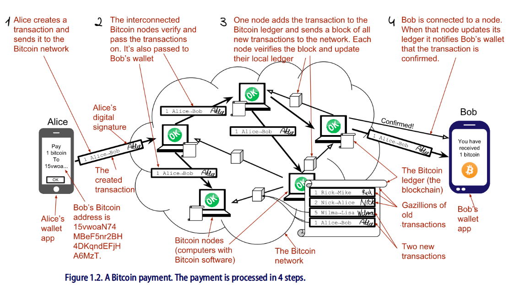
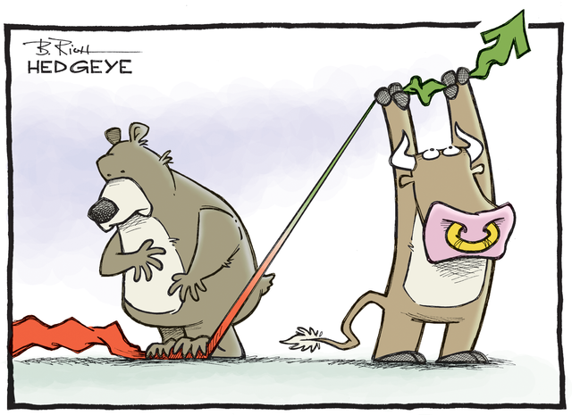
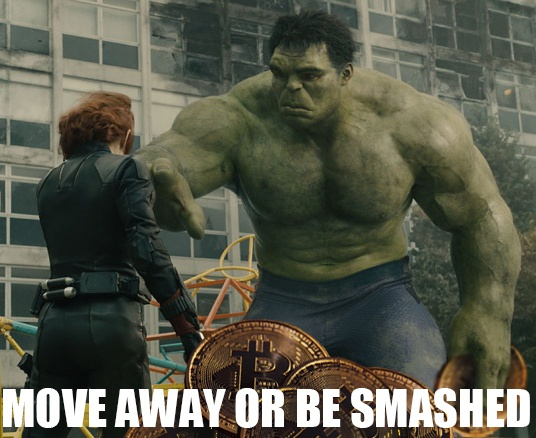

:data-transition-duration: 1000
:skip-help: true
:css: ./style.css
:substep: true

.. title: Blockchain Technology (By Ahmad Yoosofan)

:slide-numbers: true

Blockchain Technology (Bitcoin)
=================================
Ahmad Yoosofan
-------------------
University of Kashan
--------------------
2023/12/09
----------

----

A Simplified Transaction
===============================
.. image:: img/a_simiplified_transaction.png

----

Bitcoin Address(Account Number)
================================
.. image:: img/mbc2_0405.png

----

A Simplified Blockchain
==============================
.. image:: img/a_little_more_detail_of_blockchain.png

----

Block Details
===============
.. image:: img/block_structure_detail.png

----

Merkle Tree
===============
.. image:: img/merkle_tree.jpg

----

Extending Blockchain
========================
.. image:: img/branches.png

----

Finding nonce Algorithm
=========================
.. image:: img/finding_nonce.png

----

Simplified Confirmation
=======================================================

----

Double spend
=================
.. image:: img/51attack.png

----

Economial Problems
==================

----

#. Centralised Exchanges Collapse
#. Investing in a pump and dump cryptocurrency
#. Panic selling due to a crash and taking a major loss
#. Poor investment decisions leading to a loss of coins
#. Control Emotions (FOMO)
#. Intangible
#. Unreal Expectations (Lamborghini Obsession, to the moon)
#. Energy
#. Price and Market volatility and Manipulation
    #. crypto whales
    #. Banks
    #. Governments
    #. Key Loggers
#. Illiquid
#. Wide Entrance, Narrow Exit (hard to exit)
#. From Extortion To Manipulation (ICOs, IPOs, ....)
#. Don’t put all your eggs in one basket
#. Diversify your risk when investing in Bitcoin and cryptocurrencies.

----

Technological Issues
======================

----

#. Network Congestion
#. Transaction Fee
#. Transaction Time
#. Privacy! (chain analysis)
#. Updating wallets and applications
#. Reviewing news about coins and token, may need an action
#. Civil Wars With Forks
#. botnets and theft mining (monero new pow algorithm: Randomx)
#. Unexpected problems (monero website problem, link to another wallet)
#. Lack of coordination and coherence (nature of decentralization)
#. Technological Risks (programming mistakes, Hardware failure, etc.)
#. Manipulated harware or software
#. Quantumn computing

----

Scams
====================================================
.. image:: img/scam_fraud.webp

.. :

    * https://earni.fi/

    Bonk
    2023/01/11 15:51:49
    https://dexscreener.com/polygon/0x2dbbd6d439c9536362a4aa39769eae3ac48a9cfb

----

Regulatory Issues
=====================
#. Cryptocurrencies as Property
#. Decentralized Status
#. Business Registrations and Licensing
#. Uninsured
#. Unreal cryptocurrencies
    #. centralized like most stable coins, xrp and others
    #. CBDC
#. ETF (derivatives like paper gold)

----

Theft
============
.. image:: img/bitcointheft1.png

----

Other Issues
================
#. Human Error (like Forgetting passwords)
#. New tokens or coins
#. Wallet protection
#. Ransome Malwares
#. Virtual Currency Frauds
#. Unprofessinal trading (dangerous daily trading)
#. Care, Custody And Control (Exchanges, websites or unofficial wallets)
#. End of a project
    #. https://zk.money
    #. https://medium.com/aztec-protocol/sunsetting-aztec-connect-a786edce5cae

.. :

    https://youtu.be/pjVw2ZX2lBE?si=woBiMcdVluLjC214
    https://youtu.be/oU63ur0Ntfs?t=563

----

Money Laundering
====================
.. image:: img/money_laundering.png

----

Iran's Specific Problems
==========================
#. CEX censore (bittrex)
#. DEX censore
    #. UniSwap
    #. MetaMask
    #. ThorSwap
#. Iran's legal rules
#. Iranian Exchanges
#. Banned bitcoin Adresses
#. Hardware Wallets
#. Internet ban
#. USD, USDT, USDC, etc manipulation 
#. Privacy nightmare
#. Cyber Risks On All Sides
#. Passive Income

----

Store Cryptocurrency
====================
* Bitcoin
    #. Electrum wallet
    #. bitcoin.com mobile wallet
    #. bitcoin core (full node)
    #. Hardware wallet
    #. Paper (seed phrase)
* Other Cryptos
    #. Use their own Wallet on their website

----

:data-y: r1200
:data-rotate-x: 180

Q&A
=======
.. image:: img/use_computer_for_writing.jpg

.. note:

    https://en.wikipedia.org/wiki/Fiat_money
    the.evolution.of.parasite.jpg

    ----

    Extremist View against Banks and Governments
    ===============================================
    .. image:: img/fiat_is_fake_money.png
        :class: imageclass
        :width: 90%

    https://en.wikipedia.org/wiki/Hash_function
