:data-transition-duration: 1000
:skip-help: true
:css: style.css
:substep: true

.. title: Blockchain Technology (By Ahmad Yoosofan)

:slide-numbers: true

----

Blockchain Technology (Bitcoin)
=================================

And its application in Education
----------------------------------

Ahmad Yoosofan
^^^^^^^^^^^^^^^^^^^
University of Kashan

2019/12/02

----

Table of Contents
===========================

.. class:: substep

    * Test

        *  *A little History of Money*

        *  Current System and some of its problems

        *  How can we have our money

        *  P2P and simple network for coins

        *  Account Number and Encryption

        *  Hashing and Link Lists

        *  Blockchain

        *  Related Topics and Risks

        *  Blockchain in Education

        *  Q&A

----

.. class:: substep 

    sdfsf

    sfsdf22222
    
    sdf4r324
    
    
----

Barter System
==============
.. image:: img/ordinary_good_barter.jpg
    :class: imageclass
    :width: 80%

Trade without using money

----

Why money was invented
=========================
.. image:: img/barter.jpg
    :class: imageclass
    :width: 80%

----

Commodity Money
===============
.. image:: img/Commodity_Money_Conch_shells.jpg
    :class: imageclass
    :width: 80%

Conch shell

-----

Gold
=========
.. image:: img/goldnuggets.jpg
    :class: imageclass
    :width: 60%

-----

Coins
=========
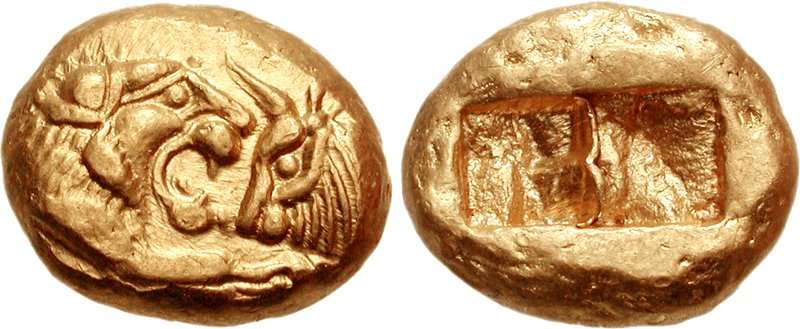

Coin type of Croesus, the Croeseid, minted in Lydia, under the rule of Cyrus the Great to Darius I. Circa 545-520[wikipedia].

----

Fiat Money and current banking system
=========================================

----

Central Bank
==============
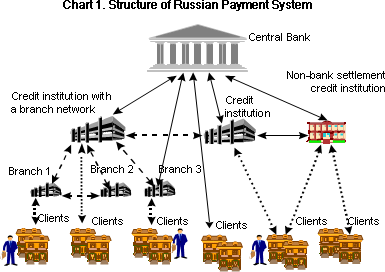

----

Bank Computer Network
==========================

.. image:: img/bank_computer_network.jpg
    :class: imageclass
    :width: 100%

----

Little More Inside
==========================

.. image:: img/system-architecture-for-central-banks-12-728.jpg
    :class: imageclass
    :width: 90%

* Cost
* Energy

----

Some Problems of Current System
==================================

----

Price Increase
==================

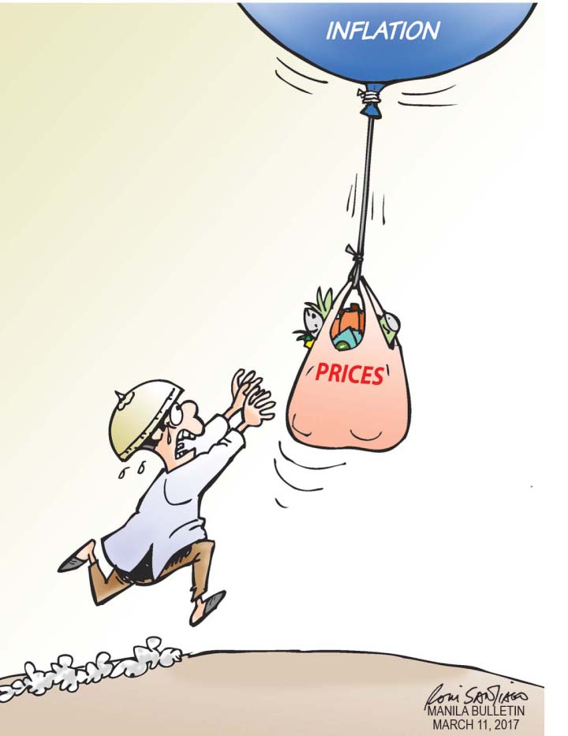

----

governmet print too much money
==================================

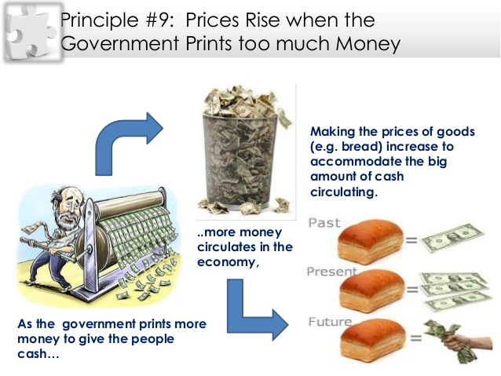

----

Fiat money with little value
==================================

----

Too Much Tax
==================

----

Unjustice
============
.. image:: img/different_wealth.png
    :class: imageclass
    :width: 80%

----

Bad economy
===============
.. image:: img/retail_cartoon_dead_customer.png
    :class: imageclass
    :width: 80%

-----

Corruption
============
.. image:: img/money_laundering.png
    :class: imageclass
    :width: 100%

----

Wrong Claims of Governments
================================
.. image:: img/Wrong_Claims_of_Governments.jpg
    :class: imageclass
    :width: 60%

----

Hacking Centralized Systems
================================
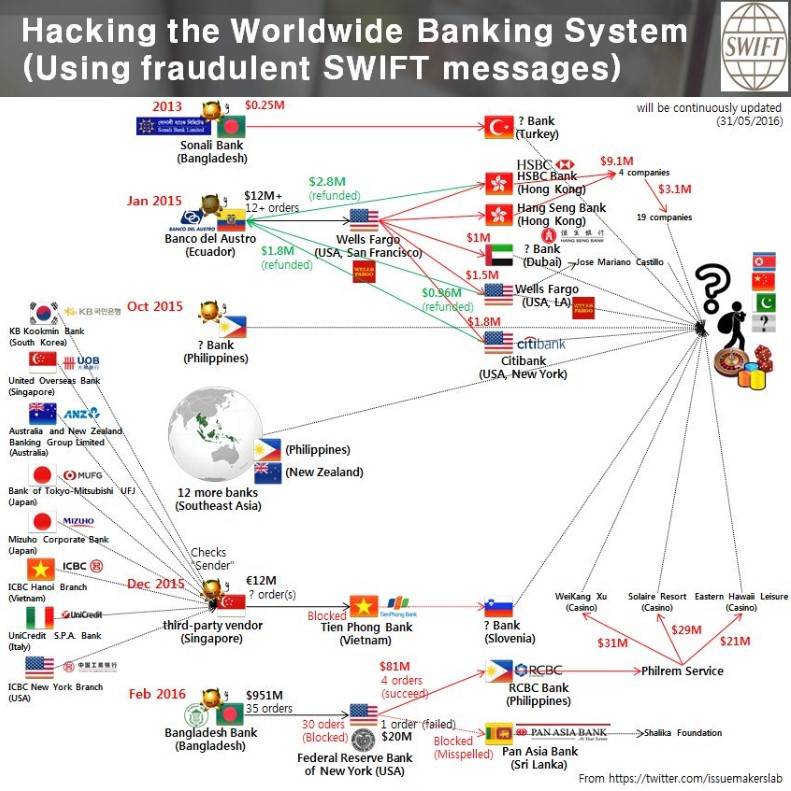

----

How can we have our money
===========================
.. image:: img/11_9.jpg
    :class: imageclass
    :width: 60%

----

Track all Transactions
===========================
.. image:: img/poker-writing-thinks-it-is.png
    :class: imageclass
    :width: 110%

----

Be Cautious about any Changes
================================
.. image:: img/gambling_on_america.jpg
    :class: imageclass
    :width: 90%

It is money !

----

Calculate and Write
================================
.. image:: img/depositphotos_202925884-stock-photo-tax-accountant-working-documents-table.jpg
    :class: imageclass
    :width: 90%

----

Use Computer for writing
================================
.. image:: img/use_computer_for_writing.jpg
    :class: imageclass
    :width: 90%

----

Computer Program keeps Track
================================
.. image:: img/applicatons_keep_track.png
    :class: imageclass
    :width: 90%

----

Star Network (Centralized)
================================
.. image:: img/server-client-communication-2597991.jpg
    :class: imageclass
    :width: 90%

----

Peer to Peer Network
================================
.. image:: img/dynamic-search-algorithm-for-unstructured-peer-to-peer-networks-3-728.jpg
    :class: imageclass
    :width: 90%

----

Broadcast to All
================================
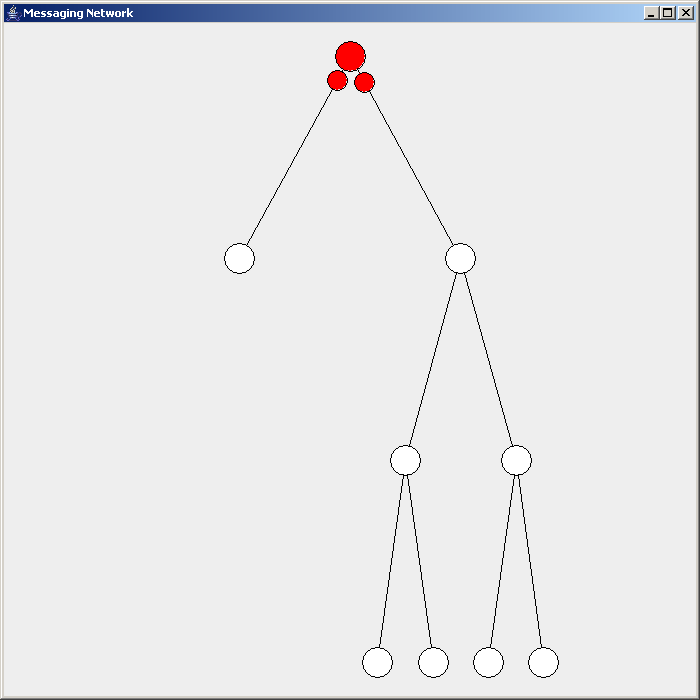

----

Similar Technology for Network in Use(torrent)
===============================================
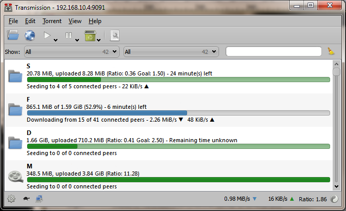

----

A very Simplified Model of How things work in Cryptocurrency
=============================================================

----

.. image:: img/very_simplified_model_for_transactioncycle.jpg
    :class: imageclass
    :width: 120%

----

A Little More Detail
========================
.. image:: img/a_little_more_detail.jpg
    :class: imageclass
    :width: 60%

----

Simplified Confirmation
=======================================================
.. image:: img/simple_bitcoin_network_send_recieve.png
    :class: imageclass
    :width: 100%

----

Account Number
==================

----

Symetric Encryption
========================
.. image:: img/symetric_encryption.png
    :class: imageclass
    :width: 100%

Flaws?

----

Asymetric Encryption
=========================

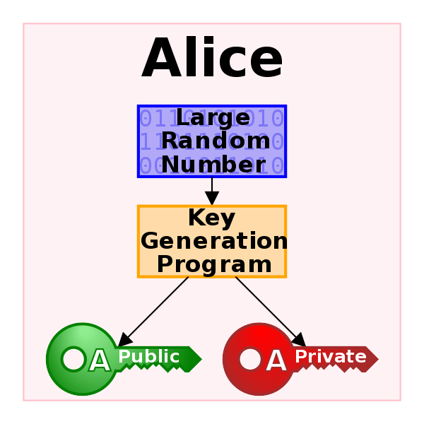

----

How Encrypt a message
=========================
.. image:: img/614px-Public_key_encryption.svg.png
    :class: imageclass
    :width: 80%

----

A Simplified Transaction
===============================
.. image:: img/a_simiplified_transaction.png
    :class: imageclass
    :width: 80%

----

A More Detail Encryption
===============================
.. image:: img/more_detail_transaction.png
    :class: imageclass
    :width: 100%

----

Transactions and TXs
=======================
.. image:: img/transactions.png
    :class: imageclass
    :width: 100%

----

Hashing
==================
.. image:: img/Cryptographic_Hash_Function.svg
    :class: imageclass
    :width: 100%

----

Simple Use of Hashing
=========================
.. image:: img/ubuntu_download_files.png
    :class: imageclass
    :width: 120%

----

Create Hash in Linux
====================
.. code:: sh

    $ cat test_sha256sum.txt
    This is a test

    $ sha256sum test_sha256sum.txt
    9d63c3b5b7623d1fa3dc7fd1547313b9546c6d0fbbb6773a420613b7a17995c8  test_sha256sum.txt

    $ cat test_sha256sum.txt
    This is a test.

    $ sha256sum test_sha256sum.txt
    11586d2eb43b73e539caa3d158c883336c0e2c904b309c0c5ffe2c9b83d562a1  test_sha256sum.txt

----

Bitcoin Address
==================
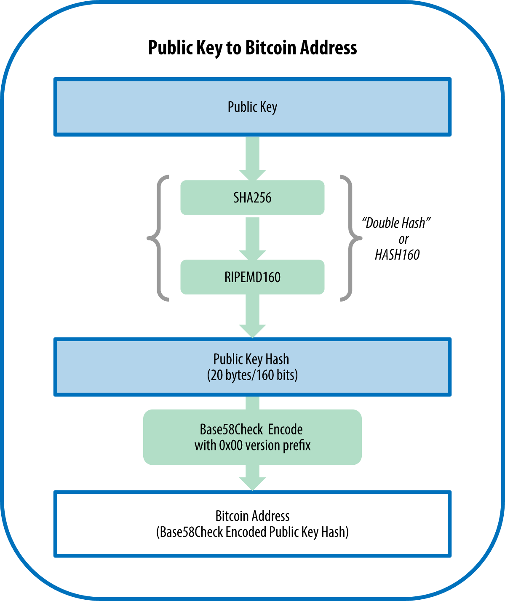

----

Linked List (Chain) vs Array
=================================
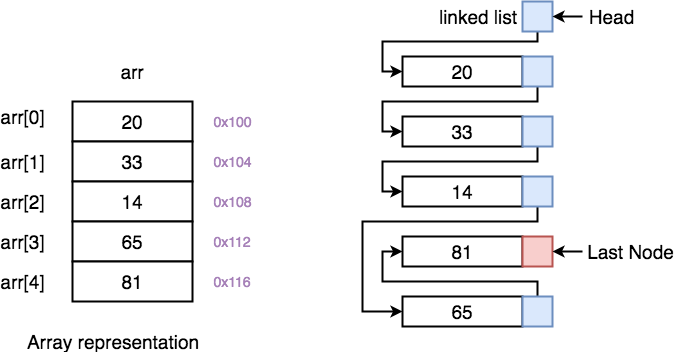

----

Linked List(Chain) vs Array (Another View)
============================================
.. image:: img/array-vs-linked-list.png
    :class: imageclass
    :width: 100%

----

Use Hash Function as Link
==========================================
.. image:: img/use_hash_function_as_link.png
    :class: imageclass
    :width: 100%

----

Blockchain
============
.. image:: img/cartoon_blockchain.png
    :class: imageclass
    :width: 100%

----

Simplified Part of Blockchain
==============================
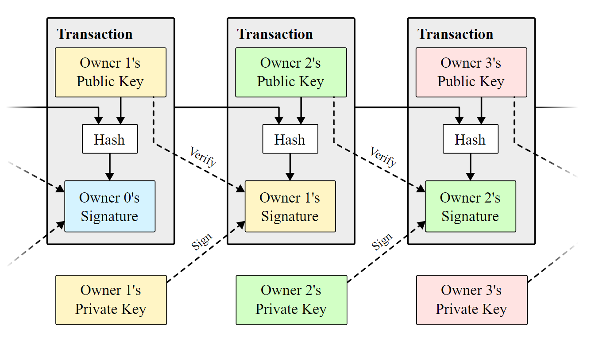

----

Block
===========
.. image:: img/Block_516635.png
    :class: imageclass
    :width: 110%

----

Block (Detail)
===============
.. image:: img/block_structure_detail.png
    :class: imageclass
    :width: 80%

----

Merkle Tree
===============
.. image:: img/merkle_tree.jpg
    :class: imageclass
    :width: 110%

----

Adding Block to Blockchain (Mining)
======================================
.. image:: img/japans-dmm-launches-large-scale-domestic-cryptocurrency-mining-farm-and-showroom.png
    :class: imageclass
    :width: 120%

----

Extending Blockchain
========================
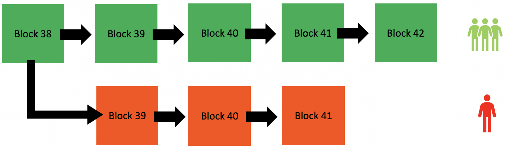

----

Finding nonce
========================
.. image:: img/Mining_finding_nonce.jpg
    :class: imageclass
    :width: 120%

----

Finding nonce Algorithm
=========================
.. image:: img/finding_nonce.png
    :class: imageclass
    :width: 120%

----

Proof of Work
=========================
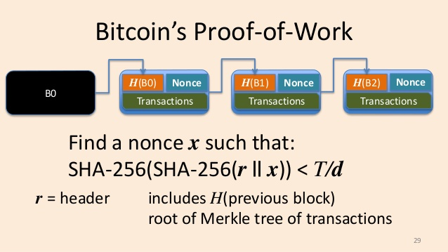

----

.. image:: img/proof_of_work_detail.jpg
    :class: imageclass
    :width: 50%

----

Double spend
=================
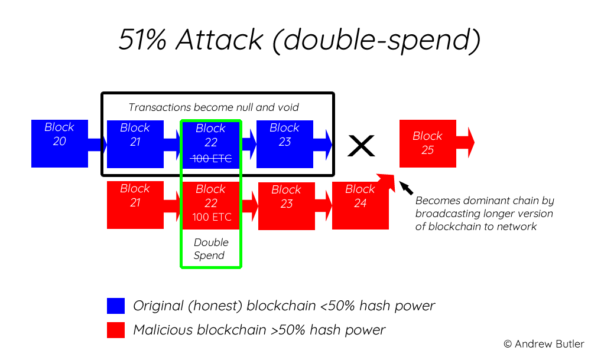

----

Blockchain in Education
========================
* Signing Documents
* Storing articles
* Storing educational contens like session videos

----

Related Topics and Risks
================================
.. image:: img/move_away_or_smashed.jpg
    :class: imageclass
    :width: 90%

----

Market Volatility
=======================

----

Bear vs Bull market
=======================
.. image:: img/bear_vs_bull.png
    :class: imageclass
    :width: 80%

----

Market Downtrend
===================
.. image:: img/market_rumbling.png
    :class: imageclass
    :width: 80%

----

Regulatory Issues
=====================
* Cryptocurrencies as Property
* Decentralized Status
* Business Registrations and Licensing

----

Most Governments agains Cryptocurrency
=======================================
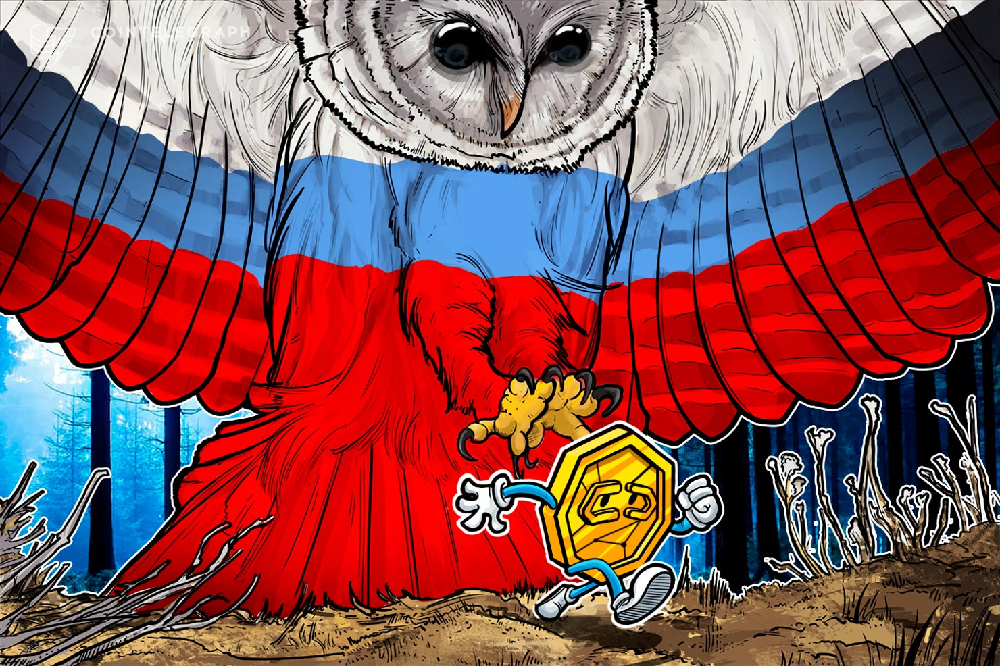

----

Longevity
============

----

Consumer Protection
====================

----

Market Manipulation
======================

* crypto whales
* Banks
* Governments

----

Wide Entrance, Narrow Exit (hard to exit)
=============================================

----

Cryptocurrency Scams (BitConnect, OneCoin, etc.)
====================================================
.. image:: img/scam_fraud.webp
    :class: imageclass
    :width: 80%

----

Human Error (like Forgetting passwords)
============================================

----

Hardware failure
=======================

----

Manipulated harware or software
=================================

----

New tokens or coins
=======================

----

Care, Custody And Control (Exchanges, websites or unofficial wallets)
========================================================================

----

Theft
============
.. image:: img/bitcointheft1.png
    :class: imageclass
    :width: 80%

----

Wallet protection
====================

----

Unprofessinal trading (dangerous daily trading)
===================================================

----

Virtual Currency Frauds
============================

----

Money Laundering
====================
.. image:: img/money_laundering.png
    :class: imageclass
    :width: 90%

----

From Extortion To Manipulation (ICOs, IPOs, ....)
====================================================

----

Cyber Risks On All Sides
===========================

----

Ransome Malwares
====================
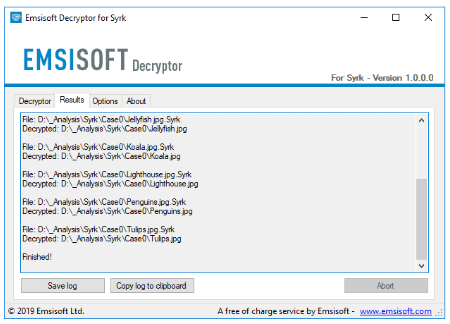

----

Technological Risks (programming mistake, )
====================================================

----

Energy
=========

----

Civil Wars With Forks
==========================

----

Unreal Expectations (Lamborghini Obsession, to the moon)
===========================================================

----

Control Emotions (FOMO)
=========================

----

Uninsured
===========

----

Intangible
===========

----

Illiquid
===========

----

Unreal cryptocurrencies (centralized like most stable coins, xrp and others)
=============================================================================

----

Lack of coordination and coherence (nature of decentralization)
===================================================================

----

botnets and theft mining (monero new pow algorithm: Randomx)
==============================================================

----

Privacy! (chain analysis)
===============================

----

Unexpected problems (monero website problem, link to another wallet)
========================================================================

----

Poor investment decisions leading to a loss of coins
======================================================

----

could be superseded by another technology
======================================================================
The coin could be superseded by another technology that is perceived to be superior (we are seeing evidence of this play out with he rise of Ethereum)

----

Quantumn computing
====================

----

Panic selling due to a crash and taking a major loss
========================================================

----

Investing in a pump and dump cryptocurrency
==================================================

----

Internet ban
===============

----

Key Logger
============

----

Mining
========
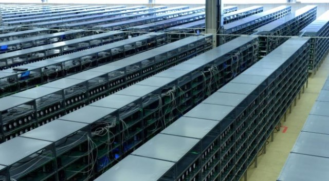

----

Network Congestion
====================

----

Transaction Fee
==================

----

Transaction Time
==================

----

How Enter to cryptocurrency
============================
* Accept in return of your service or product 
* Buy
* Mining (be very careful)

Don’t put all your eggs in one basket

Diversify your risk when investing in Bitcoin and cryptocurrencies.

----

How to use bitcoin
====================
Electrum wallet

----

Setting up wallet
===================

----

Q&A
=====

----

:data-y: r1000

Third slide
================

#. Here we have

#. A numbered list

#. It will get correct

#. Numbers automatically

----

:data-rotate: 90

Fourth slide
================

Hello

----

:data-x: r800

Fifth slide
=============

Wov

----

:id: ThreeD
:data-y: r1200
:data-rotate-x: 180

Sixth
=======
.. image:: img/scam_fraud.webp
    :class: imageclass
    :width: 90%

.. note:

    https://en.wikipedia.org/wiki/Fiat_money
    the.evolution.of.parasite.jpg

    ----

    Extremist View against Banks and Governments
    ===============================================
    .. image:: img/fiat_is_fake_money.png
        :class: imageclass
        :width: 90%

    https://en.wikipedia.org/wiki/Hash_function
